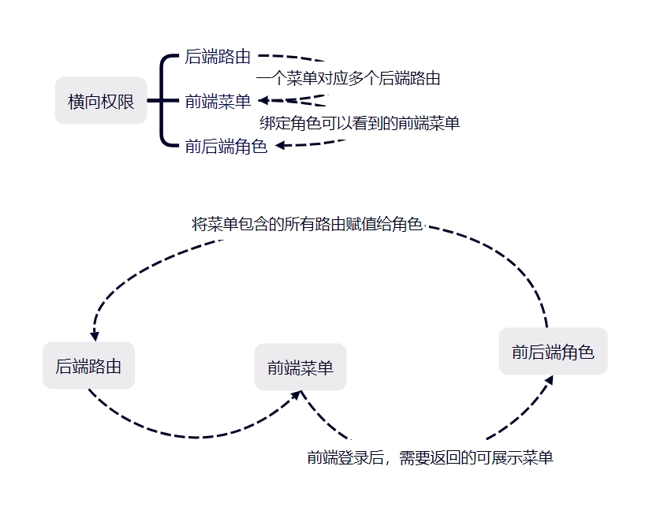

## Easy-Rbac



### 1. 安装

```composer
composer require ouhaohan8023/easy-rbac
```

### 2. 配置

```
php artisan vendor:publish --provider="Ouhaohan8023\EasyRbac\EasyRbacServiceProvider"

其中 easy-rbac.php 中配置要存入数据库的路由组
permission.php 中是在 laravel-permission 的基础上结合 easy-rbac 进行配置

```

### 3. EasyRbac 静态方法列表

| 方法名                    | 描述               | 参数                      | 返回值      |
|------------------------|------------------|-------------------------|----------|
| `syncPermission`       | 同步后端权限           | 无                       | 无        |
| `permissionTree`       | 返回权限树            | 无                       | 树状结构的路由树 |
| `initMenus`            | 使用前端路由初始化菜单      | 前端路由文件构成的JSON字符串        | 无        |
| `addMenu`              | 新增菜单             | 无                       | bool     |
| `updateMenu`           | 更新菜单             | $data 要更新的内容，$id 要更新的ID | bool     |
| `menuTree`             | 菜单树              | 无                       | 菜单树      |
| `roleTree`             | 角色树              | 无                       | 角色树      |
| `addRole`              | 新增角色             | $data                   | bool     |
| `updateRole`           | 更新角色             | $data 要更新的内容，$id 要更新的ID | bool     |
| `getMenusByUser`       | 获取用户的可用菜单树       | $user 当前用户              | 菜单树      |
| `getPermissionsByUser` | 获取用户的可用权限列表      | $user 当前用户              | 权限数组     |
| `persistenceMenus`     | 将menus表的数据持久化到本地 | 无                       | 无        |
| `restoreMenus`         | 将menus表的数据持久化到本地 | 无                       | 无        |

### 4. 命令

| 命令名                    | 描述            |
|------------------------|---------------|
| `easy:menu-persist`    | 将菜单从数据库导出到文件中 |
| `easy:menu-recover`    | 将菜单从文件恢复到数据库中 |
| `easy:sync-permission` | 同步路由          |

### 5. 使用

```composer
1. 将路由按照树形结构存入表中
EasyRbac::syncPermission();

2. 返回树状结构的路由树

use Ouhaohan8023\EasyRbac\Resource\PermissionTreeCollection;

$data = EasyRbac::permissionTree();
return new PermissionTreeCollection($data);

3. 使用预置的 FormRequest 创建菜单
use Ouhaohan8023\EasyRbac\Request\MenuRequest;

public function store(MenuRequest $request)
{
    $validated = $request->validated();
    if (isset($validated['extend'])) {
        $validated['extend'] = json_encode($validated['extend']);
    }

    DB::beginTransaction();
    $menuRe = Menu::create($validated);
    $permissionRe = true;
    if (isset($validated['guard']) && $validated['guard']) {
        $permissionRe = $menuRe->permissions()->sync($validated['guard']);
    }

    if ($menuRe && $permissionRe) {
        DB::commit();
        $this->success('');
    } else {
        DB::rollBack();
        $this->error();
    }
}

4. 初始化菜单
在前端路由文件中，使用
const asyncRoutesJson = JSON.stringify(asyncRoutes)
console.log(asyncRoutesJson, 9)
将路由转成json打印出来，然后使用下面的方法进行菜单初始化（初始化上下级关系，目前需要手动调整菜单级别 目录/菜单/按钮）
$arr = json_decode($json, true);
EasyRbac::initMenus($arr);

5. 菜单树状结构
$tree = EasyRbac::menuTree();

6. 新增菜单
{
    "system": "UserSystem",
    "name": "menu1",
    "title": "菜单1",
    "type": "menu",
    "guard": [
        97,
        53,
        11,
        95
    ],
    "isSvg": 0,
    "parent_id": 97,
    "weigh": 0,
    "noClosable": 0,
    "breadcrumbHidden": 1,
    "hidden": 0,
    "levelHidden": 0,
    "dynamicNewTab": 0,
    "activeMenu": 0,
    "state": 1,
    "badge": 0
}
EasyRbac::addMenu($data);
其中guard是权限id，parent_id是上级菜单id

7. 在路由中引入中间件，开启权限认证
->middleware(['easy-rbac']);

8. 配置文件中可以手动关闭认证
/**
 * 是否启用中间件
 */
'enable_middleware' => true,

9。 配置文件中可以指定超管角色key
/**
 * 自定义超级管理员的名称
 * 超级管理员会跳过权限认证
 */
'super_admin_key' => 'super_admin',
```
